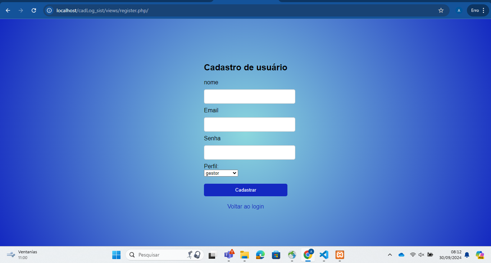
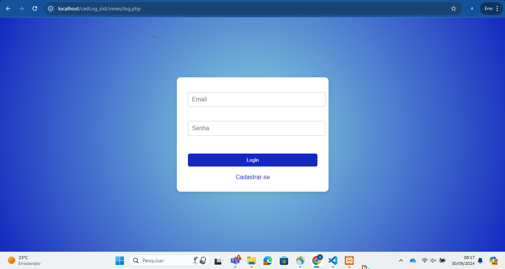
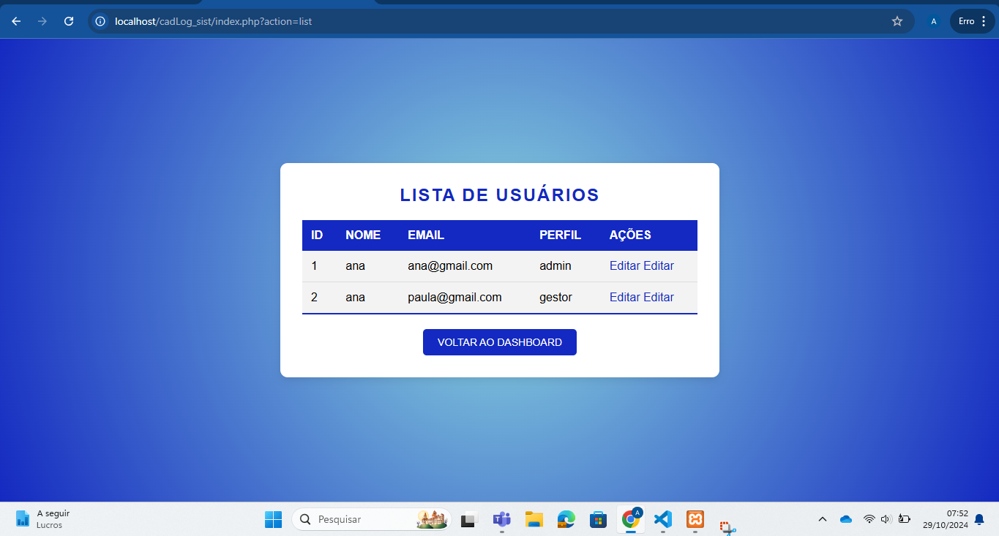

# cadLog_sist

## Descrição
 
 Esse é um projeto que foi feito em sala, nas aulas de programação web no ano de 2024, com a orientação do professor Leonardo Rocha para aumentar o comhecimento e introduzir novos aprendizados. Esse é um projeto que permite com que o usuário realize  cadastro e login no sistema. Estamos aprendendo conseitos de php esse sistema é ligado com o banco de dados
 
 
 
## Funcionalidades
 * O usuário pode fazer cadastro
 * O usuário pode faszer login
 *  Admin pode gerenciar usuários (editar e excluir)
 * Gestor pode gerenciar usuários (apenas editar)
 

 
## 💻 tecnologias utilizadas
 
* VsCode
 * HTML
 * Github
 * CSS
* php
* xampp
* apache
* mysql

## 📄 Aprendizados
Nessa atividade usamos conceitos básicos da linguagem PHP para fazer o backend e ligar a aplicação com banco de dados de acordo com os valores adicionados no HTML através das áreas que reservei para isso e estilizei com CSS.
  Com esse trabalho eu entendi um pouco mais de PHP conheci um pouco melhor a linguagem.
Pratiquei conceito básico de HTML e CSS.
* No php os aprendizads foram utilizar o method post,criptografa a senha, padrao singleton, Método público, conexão usa o driver Mysql, Função para localizar usuário pelo email, Função para encontrar usuario pelo id, Função para criar um novo usuario no banco de dados, função para todos os dados de todos os usuarios do banco de dados, Define a classe com base no perfil.
 ## processo
 Este sistema ainda não está pronto. O que ja está ponto é as paginas de login onde o usuário pode fazer o login colocando  email e senha a pagina está estilizada com css foi colocado cor, borda, as caixas de texto para inserir senha e email e os botoes de login e cadastrar-se. Os mesmos elementos foram colocados na pagina register incluindo o campo nome e um campo de para especificar se o usuário é Admim, gestor, colasborador. Agora os usuários gestor e admim podem editar os dados que foram cadastrados e o usuário adimin pode escluir usuários para isso foi criada uma tela para editar e botoes de editar e excluir tudo isso está ligado com banco de dasdos.

 
 
 
# autores
 
[Ana Paula](https://github.com/anapaulacd)
 
orientador [Leonardo](https://github.com/LeonardoRochaMarista)